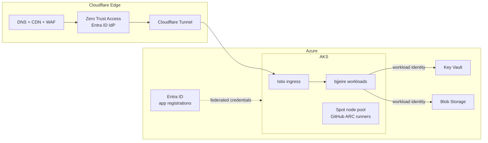

# BjjEire Platform Infrastructure

[](https://github.com/ianoflynnautomation/bjjeire-terraform-azurerm-aks/actions/workflows/terraform-quality.yml)
[](https://github.com/ianoflynnautomation/bjjeire-terraform-azurerm-aks/actions/workflows/terraform-audit.yml)


[](renovate.json)

Terraform configuration that provisions the complete Azure + Cloudflare platform for [BjjEire](https://github.com/ianoflynnautomation/bjjeire) — an AKS cluster with workload identity, edge security through Cloudflare Zero Trust, and everything Flux needs to take over from there.

## How this repo fits in

| Repository | Owns |
|------------|------|
| **bjjeire-terraform-azurerm-aks** (this repo) | Azure + Cloudflare + Entra ID infrastructure: cluster, network, identities, Key Vault, edge |
| [bjjeire-gitops](https://github.com/ianoflynnautomation/bjjeire-gitops) | Everything inside the cluster: Flux, Istio, observability, app releases |
| [bjjeire](https://github.com/ianoflynnautomation/bjjeire) | The application: API, SPA frontend, seeder |

The handoff: Terraform provisions the cluster and identities → Flux is bootstrapped against the gitops repo → Flux reconciles workloads using the workload identities and Key Vault secrets created here (via External Secrets Operator).

## Architecture



**What gets provisioned:**

- **AKS** — [AVM managed cluster module](https://github.com/Azure/terraform-azurerm-avm-res-containerservice-managedcluster); Entra RBAC, OIDC issuer + workload identity, system pool plus a Spot pool (scale-to-zero) for GitHub Actions runners
- **Network** — VNet with system/workload subnets, NSG locked to Cloudflare origin IPs
- **Cloudflare** — zone settings, WAF/cache/security-header rulesets, Tunnel (no public ingress), Zero Trust Access with Entra ID as IdP
- **Identity** — user-assigned managed identities with federated credentials for the API, seeder, Flux controllers, External Secrets, ARC test runner, and GitHub Actions OIDC (no long-lived CI secrets anywhere)
- **Key Vault** — RBAC-only (no access policies); app secrets are written here and consumed in-cluster via External Secrets
- **Entra ID** — app registrations for the API, SPA, tests, and oauth2/Access IdP flows
- **Supporting** — image storage account, resource-group budget alerts, Entra diagnostic settings

**Edge auth chain:** users hit Cloudflare Access (Entra ID at the edge) before anything reaches the tunnel; the API additionally validates JWTs via Istio. There is intentionally no oauth2-proxy in front of the frontend.

## Repository structure

```
├── main.*.tf                  # Root composition, one concern per file (aks, network, key-vault, …)
├── variables.*.tf             # Flat variables — every knob overridable from tfvars
├── outputs.tf
├── modules/
│   ├── app-registration/      # Generic, reusable primitives (singular names)
│   ├── budget/
│   ├── cloudflare-access-idp/
│   ├── cloudflare-tunnel/
│   ├── cloudflare-zone/
│   ├── entra-diagnostic-setting/
│   ├── workload-identities/   # Composition wrapper over the AVM UAMI module
│   └── bjjeire-app-registrations/  # Project-specific compositions (prefixed names)
├── environments/
│   ├── dev/                   # backend.hcl + terraform.tfvars (+ example.tfvars)
│   ├── staging/
│   └── prod/
└── .github/workflows/         # terraform-quality, terraform-audit, renovate
```

Heavyweight Azure resources use official [Azure Verified Modules](https://azure.github.io/Azure-Verified-Modules/) (AKS, VNet, Key Vault, Storage, NSG, managed identity), pinned by commit SHA. Cloudflare and Entra ID resources are local modules — no mature public equivalents exist for those providers.

## Prerequisites

| Tool | Version |
|------|---------|
| [Terraform](https://developer.hashicorp.com/terraform) | ≥ 1.14 |
| [Azure CLI](https://learn.microsoft.com/cli/azure/) | 2.60+ |
| [tflint](https://github.com/terraform-linters/tflint) | 0.53+ |
| kubectl / flux | for post-apply verification |

You also need Azure roles for RBAC assignments and app-registration creation, a scoped Cloudflare API token, and a handful of `TF_VAR_*` secrets (`cloudflare_api_token`, `github_app_private_key`, `ghcr_pat`, …). See **[setup.md](setup.md)** for the full one-time setup: required roles, secret sourcing, and post-apply steps.

## Deploying changes

Each environment is applied from the same root configuration — only the backend and tfvars differ.

```bash
# One-time per environment
terraform init -backend-config=environments/dev/backend.hcl

# Plan and review
terraform plan -var-file=environments/dev/terraform.tfvars -out=tfplan.dev

# Apply exactly what you reviewed
terraform apply tfplan.dev
```

**Promotion order is always dev → staging → prod**, with a reviewed plan at each step.

CI runs on every PR:

- **terraform-quality** — `fmt`, `validate`, tflint (root with representative var values, then each module)
- **terraform-audit** — security scanning (trivy)

## Environment strategy

One root configuration, three environments, zero per-environment code. All differences live in `environments/<env>/terraform.tfvars` — flat variables mean any setting can be overridden per environment without touching HCL. Typical differences: budget amounts, Playwright test user (dev/staging only), API authorized IP ranges, node pool sizing.

## Dependency management

Module sources are pinned to exact commits with a human-readable version comment:

```hcl
source = "git::https://github.com/Azure/terraform-azurerm-avm-res-keyvault-vault.git?ref=3735ca49887857467f3030ad72fd43705e1eb387" #v0.10.2
```

A self-hosted [Renovate workflow](.github/workflows/renovate.yaml) keeps these fresh: a regex manager bumps the SHA and version comment together, providers are grouped for patch/minor updates, and AVM pre-1.0 minor bumps plus all majors require dashboard approval. Module PRs are never auto-merged — a reviewed plan gates every promotion.

## Extending the infrastructure

- **New resource** — prefer an AVM module if one exists (pinned by SHA, wrapped in a local module if it needs composition); otherwise write a minimal local module or raw resource
- **New setting** — add a flat `variable` with a sensible default so existing tfvars keep working; never bury values in objects or hardcode per-environment logic
- **New environment** — create `environments/<env>/` with `backend.hcl` and `terraform.tfvars`, then follow [setup.md](setup.md)

## Security notes

- **No standing credentials in CI** — GitHub Actions and in-cluster workloads authenticate via workload identity federation (OIDC); the ARC test runner reaches Entra the same way
- **Key Vault is RBAC-only**; secrets flow Key Vault → External Secrets → workloads, never through pipelines
- **Secrets never enter git** — sensitive inputs come from `TF_VAR_*` environment variables; state files, plans, and private keys are gitignored
- **Origin lockdown** — the cluster is reachable only through the Cloudflare Tunnel; the NSG rejects non-Cloudflare traffic
- Vulnerability reports: see [SECURITY.md](SECURITY.md)

## Contributing

1. Branch from `main` (`feat/…`, `fix/…`, `chore/…`) and use [conventional commits](https://www.conventionalcommits.org/)
2. Run `terraform fmt -recursive`, `terraform validate`, and `tflint` locally before pushing
3. Open a PR — both CI workflows must pass; include the dev plan output for anything non-trivial
4. Never apply to staging/prod from a branch that hasn't gone through dev

## License

[MIT](LICENSE)
