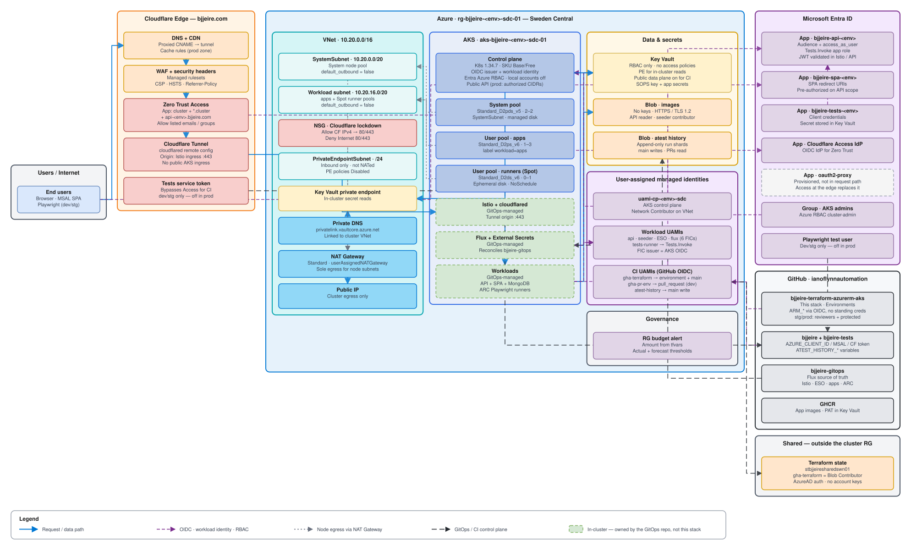

# BjjEire Platform Infrastructure

[](https://github.com/ianoflynnautomation/bjjeire-terraform-azurerm-aks/actions/workflows/terraform-pipeline.yml)


[](renovate.json)

Terraform configuration that provisions the complete Azure + Cloudflare platform
for [BjjEire](https://github.com/ianoflynnautomation/bjjeire) — an AKS cluster
with workload identity, edge security through Cloudflare Zero Trust, and
everything Flux needs to take over from there.



## Documentation

| | |
|---|---|
| **[Architecture](docs/architecture/)** | [context](docs/architecture/context.md) · [network](docs/architecture/network.md) · [identity](docs/architecture/identity.md) · [secrets](docs/architecture/secrets.md) · [environments](docs/architecture/environments.md) · [ci/cd](docs/architecture/ci-cd.md) |
| **[Decisions](docs/adr/)** | Why the Key Vault is public, why the API server is not private, why oauth2-proxy is provisioned but unused |
| **[Runbooks](docs/runbooks/)** | [One-time setup](docs/runbooks/setup.md) per environment |
| **[AGENTS.md](AGENTS.md)** | Conventions and hard rules — for coding agents and new contributors alike |

**Start with [context](docs/architecture/context.md)** for how the pieces fit
together, or [identity](docs/architecture/identity.md) if something is failing
to authenticate.

## How this repo fits in

| Repository | Owns |
|---|---|
| **bjjeire-terraform-azurerm-aks** (this repo) | Azure + Cloudflare + Entra ID infrastructure |
| [bjjeire-terraform-gitops-flux-bootstrap](https://github.com/ianoflynnautomation/bjjeire-terraform-gitops-flux-bootstrap) | Flux bootstrap; consumes workload-identity client IDs from this stack |
| [bjjeire-gitops](https://github.com/ianoflynnautomation/bjjeire-gitops) | Everything inside the cluster: Flux, Istio, observability, app releases |
| [bjjeire](https://github.com/ianoflynnautomation/bjjeire) | The application: API, SPA frontend, seeder |
| [bjjeire-tests](https://github.com/ianoflynnautomation/bjjeire-tests) | Playwright / atest; OIDC client IDs and secrets are written here |

Terraform provisions the cluster and identities → Flux is bootstrapped against
the gitops repo → Flux reconciles workloads using the workload identities and
Key Vault secrets created here.

After a **teardown and rebuild**, apply this stack first, then re-apply the
bootstrap repo so `workload-identity-config` picks up the new client IDs —
[details](docs/architecture/identity.md#after-a-teardown).

## Repository structure

```
├── main.*.tf                  # Root composition, one concern per file (aks, network, key-vault, …)
├── variables.*.tf             # Flat variables — every knob overridable from tfvars
├── outputs.tf
├── AGENTS.md                  # Conventions and hard rules
├── modules/
│   ├── app-registration/      # Generic, reusable primitives (singular names)
│   ├── budget/
│   ├── cloudflare-access-idp/
│   ├── cloudflare-tunnel/
│   ├── cloudflare-zone/
│   ├── entra-diagnostic-setting/
│   ├── workload-identities/   # Composition wrapper over the AVM UAMI module
│   └── bjjeire-app-registrations/  # Project-specific compositions (prefixed names)
├── environments/
│   ├── dev/                   # backend.hcl + terraform.tfvars (+ example.tfvars)
│   ├── staging/
│   └── prod/
├── docs/
│   ├── adr/                   # Architecture decision records
│   ├── architecture/          # How the platform is put together
│   ├── runbooks/              # Operator procedures
│   └── diagrams/              # architecture.drawio.svg (editable in draw.io)
└── .github/workflows/         # pipeline, quality, audit, drift, docs, renovate
```

Heavyweight Azure resources use official
[Azure Verified Modules](https://azure.github.io/Azure-Verified-Modules/),
pinned by registry `version`
([ADR-0001](docs/adr/0001-adopt-azure-verified-modules.md)). Cloudflare and
Entra ID resources are local modules — no mature public equivalents exist for
those providers.

## Prerequisites

| Tool | Version |
|------|---------|
| [Terraform](https://developer.hashicorp.com/terraform) | ≥ 1.14 (CI pins 1.15.3) |
| [Azure CLI](https://learn.microsoft.com/cli/azure/) | 2.60+ |
| [tflint](https://github.com/terraform-linters/tflint) | 0.53+ |
| [terraform-docs](https://terraform-docs.io/) | 0.24.0 (must match CI) |
| kubectl / flux | for post-apply verification |

You also need Azure roles for RBAC assignments and app-registration creation, a
scoped Cloudflare API token, and a handful of `TF_VAR_*` secrets. See
**[docs/runbooks/setup.md](docs/runbooks/setup.md)**.

## Deploying changes

Each environment is applied from the same root configuration — only the backend
and tfvars differ.

```bash
# One-time per environment (laptop bootstrap — creates the gha_terraform UAMI
# and writes ARM_* onto the GitHub Environment). After that, prefer CI.
terraform init -backend-config=environments/dev/backend.hcl

export TF_VAR_github_token="${TF_VAR_github_token:-$(gh auth token)}"

terraform plan -var-file=environments/dev/terraform.tfvars -out=tfplan
terraform apply tfplan
```

**Promotion order is always dev → staging → prod.** Staging and prod apply
through `workflow_dispatch` with GitHub Environment reviewers, never from a
laptop. Full pipeline detail in [ci-cd.md](docs/architecture/ci-cd.md).

## Security

- **No standing credentials.** GitHub Actions and in-cluster workloads
  authenticate by workload identity federation —
  [identity.md](docs/architecture/identity.md).
- **Secrets never enter git or pipeline output.** Terraform → Key Vault →
  External Secrets → pods —
  [secrets.md](docs/architecture/secrets.md).
- **Origin lockdown.** The cluster is reachable only through the Cloudflare
  Tunnel; the NSG rejects non-Cloudflare traffic —
  [network.md](docs/architecture/network.md).
- **Prod fails closed.** Local kube accounts off, API server CIDRs required by a
  plan-time validation, Playwright user and Cloudflare tests token forced off —
  [environments.md](docs/architecture/environments.md#fail-closed-prod).

Some settings here look like findings and are deliberate — the Key Vault public
data plane ([ADR-0002](docs/adr/0002-keep-key-vault-public-data-plane.md)) and
the public AKS API server
([ADR-0003](docs/adr/0003-public-aks-api-server.md)) in particular. Read the
ADR before changing either.

Vulnerability reports: [SECURITY.md](SECURITY.md).

## Contributing

1. Branch from `main` (`feat/…`, `fix/…`, `chore/…`) and use
   [conventional commits](https://www.conventionalcommits.org/).
2. Run `terraform fmt -recursive`, `terraform validate`, `terraform test`, and `tflint` locally —
   or `pre-commit run --all-files`, which also regenerates module docs.
3. Update the matching page under `docs/architecture/` when you change
   topology, identity, or network posture. Record new decisions as an ADR.
4. Open a PR — quality, IaC scan, docs check, and a dev plan must pass.
5. Never apply to staging or prod from a branch that has not gone through dev.

## License

[MIT](LICENSE)
