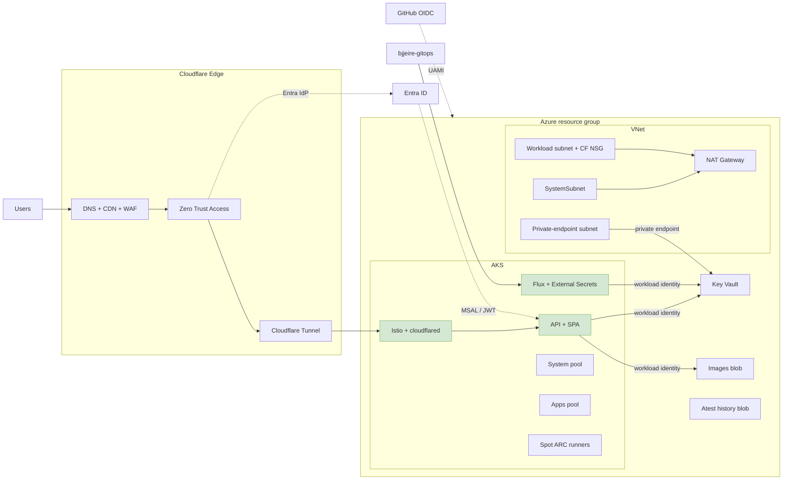

# Context

What this stack owns, what it hands off, and how a request reaches the
application.

## Repository boundaries

| Repository | Owns |
|---|---|
| **bjjeire-terraform-azurerm-aks** (this repo) | Azure + Cloudflare + Entra ID infrastructure: cluster, network, identities, Key Vault, edge, GitHub OIDC |
| [bjjeire-terraform-gitops-flux-bootstrap](https://github.com/ianoflynnautomation/bjjeire-terraform-gitops-flux-bootstrap) | Flux bootstrap; consumes workload-identity client IDs from this stack |
| [bjjeire-gitops](https://github.com/ianoflynnautomation/bjjeire-gitops) | Everything inside the cluster: Flux, Istio, observability, app releases |
| [bjjeire](https://github.com/ianoflynnautomation/bjjeire) | The application: API, SPA frontend, seeder |
| [bjjeire-tests](https://github.com/ianoflynnautomation/bjjeire-tests) | Playwright / atest; OIDC client IDs and secrets are written here |

The handoff: Terraform provisions the cluster and identities → Flux is
bootstrapped against the gitops repo → Flux reconciles workloads using the
workload identities and Key Vault secrets created here, via External Secrets
Operator.

## System context

Green nodes are **GitOps-managed** — this stack provisions the platform they
run on, not the workloads themselves.

A detailed, editable version of the same topology is
[`docs/diagrams/architecture.drawio.svg`](../diagrams/architecture.drawio.svg) —
it renders inline on GitHub and opens in [diagrams.net](https://app.diagrams.net/)
or the draw.io VS Code extension for editing.

## Request path

Browser → Cloudflare DNS/CDN/WAF → Zero Trust Access (Entra as IdP) → Tunnel →
in-cluster `cloudflared` → Istio → SPA or API. The SPA then authenticates with
MSAL; the API and Istio validate the resulting JWTs.

There is **no oauth2-proxy in front of the frontend**. The app registration
still exists, but Access replaced it at the edge —
[ADR-0004](../adr/0004-cloudflare-access-replaces-oauth2-proxy.md).

The cluster has no public ingress. Its only inbound path is the tunnel, and the
workload subnet's NSG rejects anything that is not Cloudflare —
[network.md](network.md).

## What this stack provisions

- **AKS** — [AVM managed cluster](https://github.com/Azure/terraform-azurerm-avm-res-containerservice-managedcluster);
  Entra Azure RBAC, local accounts off, OIDC issuer + workload identity, public
  API server ([ADR-0003](../adr/0003-public-aks-api-server.md)). Control plane
  uses a user-assigned identity ([ADR-0007](../adr/0007-user-assigned-control-plane-identity.md)).
- **Node pools** — system pool on `SystemSubnet`; an **apps** user pool
  (`Standard_D2ps_v6`, 1–3, `workload=apps`) and a **runners** Spot pool
  (`Standard_D2ds_v6`, 0–1, ephemeral disk, `NoSchedule` taints) on the
  workload subnet for GitHub ARC.
- **Network** — VNet with system / workload / private-endpoint subnets, NAT
  Gateway egress, Cloudflare-only NSG. See [network.md](network.md).
- **Key Vault** — RBAC-only, private endpoint for in-cluster reads, public data
  plane kept on for CI ([ADR-0002](../adr/0002-keep-key-vault-public-data-plane.md)).
  See [secrets.md](secrets.md).
- **Cloudflare** — Tunnel, Zero Trust Access with Entra as IdP, tests service
  token on dev/staging. Zone WAF/cache/HSTS rulesets when
  `cloudflare_manage_zone = true`.
- **Identity** — UAMIs with federated credentials for API, seeder, Flux, External
  Secrets, the ARC tests runner, GitHub Actions Terraform, PR-env, and atest
  history. See [identity.md](identity.md).
- **Entra ID** — app registrations for API, SPA, tests, the Cloudflare Access
  IdP, and oauth2-proxy. Optional Playwright test user on non-prod.
- **Storage** — images account (keys off; API reader, seeder contributor;
  public blob serving currently off — images ship in the frontend container).
  Optional atest-history account for flake baselines.
- **GitHub** — Environments `dev` / `staging` / `prod` with `ARM_*` via OIDC,
  plus Actions secrets and variables on the app and tests repos.
- **Supporting** — resource-group budget alerts; Entra diagnostic export
  (wired, currently unset).

Remote Terraform state lives outside the cluster resource group, in
`rg-state-shared-swn-01` / `stbjjeiresharedswn01`. The `gha_terraform` identity
holds `Storage Blob Data Contributor` on that account; the backend uses
`use_azuread_auth`, so there are no account keys.

## Environments

Same root module, three environments, zero per-environment code — all
differences live in `environments/<env>/terraform.tfvars`. See
[environments.md](environments.md).
