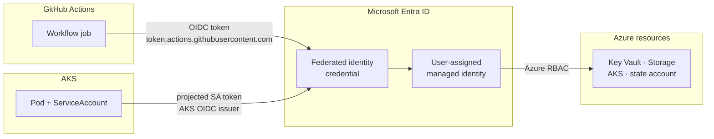

# Identity and trust

Every principal in this platform authenticates by federation. There are no
client secrets in CI, no kubeconfig files, and no storage account keys. This is
the most intricate part of the stack and the part most likely to break after a
teardown — start here.

Source: [`main.identity.tf`](../../main.identity.tf),
[`modules/workload-identities/`](../../modules/workload-identities/),
[`main.github-terraform-ci.tf`](../../main.github-terraform-ci.tf).

## The three trust chains



A federated identity credential is a triple of **issuer**, **subject**, and
**audience** attached to a managed identity. The audience is always
`api://AzureADTokenExchange`. A credential trusts exactly one subject — this is
the single most common cause of failure here, because two repositories or two
ServiceAccounts need two credentials, not one.

## Control plane identity

| Identity | Name | Role | Scope |
|---|---|---|---|
| `cluster_identity` | `uami-cp-<env>-<loc>` | `Network Contributor` | The VNet |

User-assigned rather than system-assigned, so the role assignment survives a
cluster replacement — see [ADR-0007](../adr/0007-user-assigned-control-plane-identity.md).

## In-cluster workload identities

Issuer is the cluster's OIDC issuer URL
(`module.aks.oidc_issuer_profile_issuer_url`) for all of these. Subjects are
Kubernetes ServiceAccounts, in `system:serviceaccount:<namespace>:<name>` form.

| Identity | Name | ServiceAccount subject | Azure access |
|---|---|---|---|
| `external_secrets` | `uami-extsecrets-<env>-<loc>` | `external-secrets:external-secrets` | `Key Vault Secrets User` |
| `api` | `uami-bjjeire-api-<env>-<loc>` | `bjjeire:bjjeire-api` | `Storage Blob Data Reader` on the images account |
| `seeder` | `uami-bjjeire-seeder-<env>-<loc>` | `bjjeire:bjjeire-seeder` | `Storage Blob Data Contributor` on the images account |
| `flux` | `uami-flux-<env>-<loc>` | six, see below | `Key Vault Secrets User` |
| `tests_runner` | `uami-tests-runner-<env>-<loc>` | `actions-runner-system:gha-runner-scale-set` | `Tests.Invoke` app role on the API service principal |

**Flux takes six credentials on one identity**, one per controller, because
each controller runs under its own ServiceAccount in `flux-system`:
`source-controller`, `kustomize-controller`, `helm-controller`,
`image-reflector-controller`, `image-automation-controller`,
`notification-controller`.

`tests_runner` is the identity attached to the ARC runner ServiceAccount. The
runner pod executing Playwright suites reaches Entra as this identity, so the
in-cluster test runner needs no client secret. Its `Tests.Invoke` grant
(`azuread_app_role_assignment.tests_runner_invoke`) is the same app role the
`bjjeire-tests` service principal holds, given to a separate runtime identity.

## GitHub Actions identities

Issuer is `https://token.actions.githubusercontent.com`. Subjects are GitHub
OIDC claims.

| Identity | Name | Subjects | Azure access |
|---|---|---|---|
| `gha_terraform` | `uami-gha-tf-<env>-<loc>` | `environment:<env>`, `ref:refs/heads/main` | `Contributor` + `User Access Administrator` on the workload RG; `Storage Blob Data Contributor` on the state account |
| `gha_pr_env` *(dev only)* | `uami-gha-prenv-<env>-<loc>` | `pull_request` and `ref:refs/heads/main`, on both `bjjeire-tests` and `bjjeire` | `AKS Cluster User Role` + custom namespace-admin role, both scoped to the cluster; `Storage Blob Data Reader` on the atest account |
| `gha_atest_history` *(when enabled)* | `uami-atest-history-<env>-<loc>` | `ref:refs/heads/main` on both `bjjeire-tests` and `bjjeire` | `Storage Blob Data Contributor` on the atest account |

Three deliberate properties:

**`gha_terraform` has no `pull_request` subject.** A pull request can *plan*
against `dev` — the `dev` GitHub Environment has no reviewers and no protected
branch policy, so a PR job may enter it — but it cannot obtain a token for
staging or prod, and it cannot apply. See
[ADR-0008](../adr/0008-pr-environment-identity-is-dev-only.md).

**Write access to the atest flake baseline is `main`-only.** `gha_atest_history`
writes; `gha_pr_env` reads. A pull request scores against the trunk baseline and
cannot amend it. That split is the reason the two identities exist separately
rather than as one.

**Two repositories mean two credentials.** `bjjeire` has GitHub's immutable
subject format enabled, so its subjects carry numeric IDs:

```
repo:<org>@<owner_id>/<repo>@<repo_id>:ref:refs/heads/main    # bjjeire
repo:<org>/<repo>:ref:refs/heads/main                          # bjjeire-tests
```

`gha_atest_history` holds both. It previously trusted `bjjeire-tests` alone
while the analyze job actually ran in `bjjeire`'s `ci-main`. The token exchange
failed with **AADSTS70021** (no matching federated identity record) and history
was never written — which surfaces as flake verdicts reading "insufficient
data" forever, indistinguishable from a new store still filling its window.

## Entra ID application registrations

| Registration | Purpose |
|---|---|
| `bjjeire-api-<env>` | API audience, `access_as_user` scope, `Tests.Invoke` app role. JWTs validated by Istio and the API. |
| `bjjeire-spa-<env>` | SPA redirect URIs, pre-authorized on the API scope, MSAL in the browser. |
| `bjjeire-tests-<env>` | Client credentials, `Tests.Invoke` on the API SP, secret stored in Key Vault. |
| Cloudflare Access IdP | OIDC provider for Zero Trust, callback to `<team>.cloudflareaccess.com`. |
| oauth2-proxy | Provisioned, **not in the request path** — see [ADR-0004](../adr/0004-cloudflare-access-replaces-oauth2-proxy.md). |

Plus `grp-bjjeire-aks-admins` (Azure RBAC cluster-admin on AKS) and an optional
Playwright test user, forced off in prod.

## What this stack publishes

Because a recreated identity gets a new client ID, this stack writes the IDs
outward rather than leaving CI pointing at a deleted principal
(`main.github-actions.tf`, gated on `github_manage_actions_oidc`, which
defaults on for dev only):

- **This repo's GitHub Environments** — `ARM_CLIENT_ID`, `ARM_TENANT_ID`,
  `ARM_SUBSCRIPTION_ID`, `TF_STATE_RG`, `TF_STATE_ACCOUNT`.
- **`bjjeire` and `bjjeire-tests`** — `AZURE_CLIENT_ID` (the `gha_pr_env`
  client ID), `AZURE_TENANT_ID`, `AZURE_SUBSCRIPTION_ID`, the tests app
  credentials, `AZURE_API_SCOPE`, `AZURE_AUTHORITY`, optional Cloudflare Access
  service token and Playwright user, and `ATEST_HISTORY_*`.
- **`bjjeire` only** — `VITE_APP_MSAL_*` build args for the SPA. Stale values
  here bake a frontend that attaches JWTs the new API cannot validate; catalog
  GETs then return 401.

A `terraform_data` precondition fails the plan if `github_manage_actions_oidc`
is false on dev, because that apply would leave CI on deleted identities
(**AADSTS700016** / **AADSTS7000215**).

## After a teardown

Order matters:

1. Apply **this** stack. It recreates the UAMIs and federated credentials, the
   Key Vault secrets, the tunnel CNAMEs, and rewrites `AZURE_CLIENT_ID` on the
   app and tests repos.
2. Re-apply
   [`bjjeire-terraform-gitops-flux-bootstrap`](https://github.com/ianoflynnautomation/bjjeire-terraform-gitops-flux-bootstrap)
   so its `workload-identity-config` ConfigMap picks up the new client IDs.
3. Flux reconciles `bjjeire-gitops` using the new identities.

Skipping step 2 leaves ServiceAccount annotations pointing at client IDs that
no longer exist. Pods start, then fail token exchange at first Azure call.

Full procedure: [docs/runbooks/setup.md](../runbooks/setup.md).

## Debugging token exchange

| Symptom | Usually means |
|---|---|
| `AADSTS70021` no matching federated identity record | Subject mismatch — wrong repo, wrong branch, wrong ServiceAccount, or immutable subject format not accounted for |
| `AADSTS700016` application not found | Identity was recreated; the consumer still holds the old client ID (re-run step 1–2 above) |
| `AADSTS7000215` invalid client secret | A consumer is still using secret auth where federation is expected |
| 403 on Key Vault from a pod | Missing `Key Vault Secrets User`, or the pod resolved the public endpoint instead of the private one |
| 403 writing atest history from a PR | Working as designed — PRs hold `Storage Blob Data Reader` |
