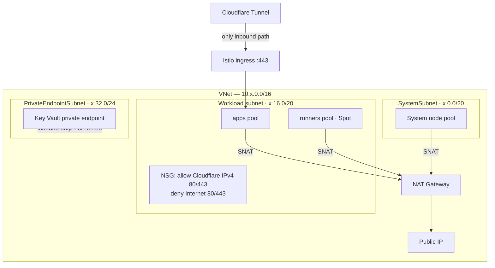

# Network

The cluster has no public ingress. Inbound arrives only through the Cloudflare
Tunnel; outbound leaves only through a user-assigned NAT Gateway.

Source: [`main.network.tf`](../../main.network.tf),
[`main.nsg.tf`](../../main.nsg.tf).

## Subnets

| Subnet | Dev CIDR | Purpose | NAT | NSG | PE policies |
|---|---|---|---|---|---|
| `SystemSubnet` | `10.20.0.0/20` | System node pool | Yes | — | Enabled |
| Workload subnet | `10.20.16.0/20` | `apps` + `runners` pools | Yes | Cloudflare lockdown | Enabled |
| `PrivateEndpointSubnet` | `10.20.32.0/24` | Key Vault private endpoint | No | — | Disabled |

Staging uses `10.30.0.0/16` and prod `10.40.0.0/16`, with the same relative
offsets.

All three set `default_outbound_access_enabled = false`, so there is no
implicit Azure SNAT. The two node subnets get egress from the NAT Gateway
instead. The private-endpoint subnet is inbound-only and deliberately not
NATed; its `private_endpoint_network_policies` are `Disabled` because the
policy blocks private endpoint creation.

Ordering matters: the NAT Gateway is created first and associated with the
subnets in `local.subnets`, so node subnets have egress from the moment they
exist rather than briefly having none.

## Egress

`NAT Gateway` + one `Public IP`, named `natgw-<cluster>` and
`pip-natgw-<cluster>`. The cluster uses `outbound_type = userAssignedNATGateway`.

This gives every node a single, stable egress address — which is what makes it
possible to allowlist the platform's own traffic at a Key Vault firewall or an
upstream API, and what keeps SNAT port exhaustion out of the picture compared
with load-balancer outbound rules.

## Origin lockdown

`module.cloudflare_ingress_nsg` (created when
`enable_cloudflare_origin_lockdown` is true) attaches to the workload subnet
with four rules:

| Rule | Access | Source | Port |
|---|---|---|---|
| `AllowCloudflareHTTPSInbound` | Allow | Cloudflare IPv4 ranges | 443 |
| `AllowCloudflareHTTPInbound` | Allow | Cloudflare IPv4 ranges | 80 |
| `DenyInternetHTTPSInbound` | Deny | `Internet` | 443 |
| `DenyInternetHTTPInbound` | Deny | `Internet` | 80 |

Allow priorities sit above the denies. The Cloudflare range list is held in
`local.cloudflare_ipv4_default` in `main.nsg.tf`, sourced from
<https://www.cloudflare.com/ips-v4>, and can be pinned per environment via
`var.cloudflare_ipv4_ranges`.

**This list needs periodic refreshing.** Cloudflare adds ranges; a stale list
silently denies traffic from new edge IPs, which presents as intermittent 5xx
from some geographies only.

IPv6 is not covered. The rules are IPv4-only, matching the cluster's IPv4 node
network.

## Private DNS

`privatelink.vaultcore.azure.net`, linked to the cluster VNet with
`registration_enabled = false`. This is what makes an in-cluster Key Vault
lookup resolve to the private endpoint address rather than the public one.

If a pod is reaching Key Vault over the public endpoint — visible as traffic
leaving through the NAT Gateway public IP — the zone link or the private
endpoint DNS zone group is the thing to check.
