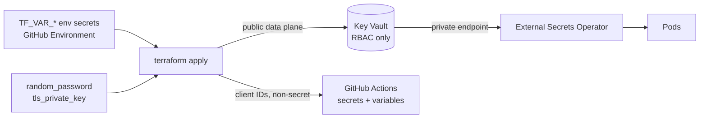

# Secrets

Secrets flow **Terraform → Key Vault → External Secrets Operator → pod**. They
never pass through pipeline logs, artifacts, or the GitOps repository.

Source: [`main.key-vault.tf`](../../main.key-vault.tf).

## Where values come from

| Origin | Examples |
|---|---|
| `TF_VAR_*` environment secrets | `cloudflare_api_token`, `github_app_private_key`, `ghcr_pat`, `github_preview_pat`, `private_email` |
| Generated in-stack | `grafana_admin_password`, `bjj_mongodb_root_password`, `oauth2_proxy_cookie_secret`, `flux_preview_webhook_token`, the AKS SSH keypair |
| Derived from other resources | tunnel token, MSAL client IDs, API audience, tests client secret, Cloudflare Access service token |

`TF_VAR_*` values are long-lived tokens that are **not** outputs of this stack.
They are set once per GitHub Environment in the UI and never written by
Terraform.

## Access model

Key Vault is **RBAC-only** — `legacy_access_policies_enabled` is off. Three
role assignments exist (`local.kv_role_assignments`):

| Principal | Role |
|---|---|
| The apply principal (`data.azurerm_client_config.current`) | `Key Vault Administrator` |
| `external_secrets` workload identity | `Key Vault Secrets User` |
| `flux` workload identity | `Key Vault Secrets User` |

Nothing else can read the vault. Application pods do not talk to Key Vault
directly — External Secrets does, and projects the result into Kubernetes
Secrets.

## Network posture

In-cluster reads go over the private endpoint in `PrivateEndpointSubnet`,
resolved through the `privatelink.vaultcore.azure.net` zone.

The **public data plane stays enabled** so GitHub-hosted `terraform apply` can
write secrets. This is deliberate and load-bearing; read
[ADR-0002](../adr/0002-keep-key-vault-public-data-plane.md) before changing
`kv_public_network_access_enabled` or `kv_network_acls`.

Prod narrows it with `default_action = "Deny"` plus operator/VPN/CI CIDRs in
`ip_rules`. `Deny` with an empty `ip_rules` breaks apply.

## Empty-string fallbacks

Several secrets exist with empty values when a feature is off — the tests app
registration, the Cloudflare Access service token, the Playwright user. This
keeps the secret *schema* stable across environments so ExternalSecret
manifests in the GitOps repo do not need per-environment variants.

Consumers must treat an empty value as "this auth method is disabled in this
environment", not as a missing secret.

## The SOPS key

The vault also holds an RSA key (`sops-encryption-key`) used by the SOPS CLI to
encrypt secrets committed to the GitOps repository. Its key ID is exposed as
the `sops_key_id` output. This is the one secret material that is *meant* to
have ciphertext in git.

## What is published outward

Client IDs, tenant IDs, storage account names, and the API scope are written to
GitHub Actions secrets and variables so a recreated identity cannot leave CI
pointing at a deleted principal. `ATEST_HISTORY_ACCOUNT` and
`ATEST_HISTORY_CLIENT_ID` are deliberately **variables, not secrets** — they
are public identifiers, and masking them only makes debugging harder.

Details in [identity.md](identity.md#what-this-stack-publishes).

## Rules

- Never add a secret value to a `.tfvars` file. This repository is public.
- Never `terraform output` a secret into a workflow step that is not masked.
- Generated passwords stay generated — do not replace a `random_password` with
  a literal to make an environment reproducible.
- Plans contain every secret in cleartext, which is why CI never uploads one:
  [ADR-0006](../adr/0006-no-plan-artifacts-in-a-public-repo.md).
